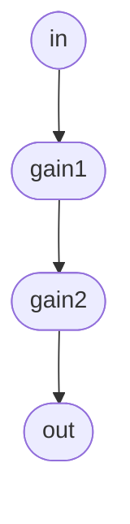

# Getting Started with Cmajor


## Using Cmajor in VScode

If you're a VScode user, then the [Cmajor VScode extension](https://marketplace.visualstudio.com/items?itemName=
CmajorSoftware.cmajor-tools) offers a hassle-free way to play with the language.

It's a one-click process to get up and running: VScode will automatically install everything you need to create, edit and test Cmajor patches. Simply go to the extensions tab in VScode, search for "Cmajor" and click "install" on the extension.

The extension provides syntax-highlighting for Cmajor code, and adds some new commands to the VScode command-palette. The commands include:

#### `Cmajor: Run patch`

If you open a `.cmajorpatch` file in the editor, then invoking this command will build and run it.

Any compile errors will be reported in the problems panel, making it easy to fix mistakes. When your patch compiles successfully, it'll open a separate pop-up window showing its GUI, and any output while running will appear in the embedded terminal inside VScode. To stop the patch running, you can either close its popup window, or kill the process in the terminal.

While a patch is running, re-saving any of the patch source files should automatically trigger a rebuild and reload, so you can immediately see the effect of your changes.

#### `Cmajor: Create a new patch`

This command will prompt you to select the name of a new `.cmajorpatch` file. It will then create a template patch and some simple placeholder code as a way of getting started. You can run it with the `Cmajor: Run patch` command, and use it as a starting point to build upon.

#### `Cmajor: Find example patches`

This command will take you to the Cmajor repository where you can find our example patches. You can either clone the [whole repository](https://github.com/cmajor-lang/cmajor) from github, or just download specific examples from the [examples](https://github.com/cmajor-lang/cmajor/tree/main/examples/patches) folder.

#### `Cmajor: Export patch as JUCE plugin`

This will prompt you for a folder in which to create a new JUCE project containing a complete C++ version of the patch that has focus. This allows you to build a native VST/AU/AAX plugin of your patch.

-------------------------------------------------------------------------------

## Installing the Cmajor command-line tools

On the Github releases page, you'll find [downloadable binaries for Mac and Windows](https://github.com/cmajor-lang/cmajor/releases). These provide:

- The command-line tool (`cmaj` or `cmaj.exe`) which provides a compiler, utilities and can load and run Cmajor patches.
- The redistributable libraries (`CmajPerformer.dll` or `libCmajPerformer.so`) which are needed if you're building your own native app which embeds the Cmajor JIT engine.
- Builds of the Cmajor VST/AU plugin, which can be used in DAWs and other audio hosts to run Cmajor patches.

### The `cmaj` command-line tool

The `cmaj` command can create, build, test and run patches, as well as perform code-generation of C++ and plugin projects, and various other tasks.

To install, just [download](https://github.com/cmajor-lang/cmajor/releases) and unzip the executable into a location of your choice, and you can run it from a terminal.

For help, run:

```shell
$ cmaj help
```

And it'll show you the latest set of available arguments.

## Playing a patch with the console app

To get started, you might want to try some of the example patches using `cmaj play`:

```shell
$ cmaj play /path-to-your-repo/examples/patches/HelloWorld/HelloWorld.cmajorpatch
```

This will open a window to display any controls that the patch may provide, and you should hear a nice tune playing. If you've got a MIDI keyboard then it should be opened and sent to the running patch (if it needs MIDI input).

There are command-line options to give you a bit more control over which audio and MIDI devices are used, but the command-line app is only attempting to be a quick-and-dirty patch player. For more serious control, you probably want to load your patch into a proper audio host via our Cmajor JIT plugin, which will let you route it however you like, and provide any kind of i/o to it.

While running a patch, the console app will detect any file changes and recompile/reload, so you can quickly experiment with changes to your code.

## Loading patches in your DAW with the Cmajor VST/AU plugin

In our [binary releases](https://github.com/cmajor-lang/cmajor/releases), you'll find an installer for our plugin, which can be loaded into most DAWs like any other plugin.

When you create an instance of this plugin in a DAW, you can drag-and-drop a `.cmajorpatch` file onto the plugin's GUI to make it load that patch.

It's worth noting that the nature of the VST/AU plugin formats make it practically impossible for a plugin to dynamically change its parameter list or the number of input/output channels that it provides. This obviously means that when you ask the plugin to load a patch with a different number of parameters or a different endpoint configuration, DAWs aren't always going to deal with that situation correctly. In response, we've had to resort to some annoying restrictions (like always having a fixed-size list of parameters regardless of how many the patch has), but we'll keep trying to find new tricks and workarounds in the future to make this work better.

-------------------------------------------------------------------------------

## Creating a new empty patch

To get started with a new patch, the `cmaj` app can generate the basic boilerplate files needed. Just run:

```shell
$ cmaj create --name="Hello" MyNewPatchFolderName
```

This creates a new folder containing a patch called "Hello" that can be explored, renamed and built upon. For in-depth details on how these files work, see the [Patch Format Guide](https://cmajor.dev/docs/PatchFormat)

The VScode extension also provides the `Cmajor: Create a new patch` command to do the same thing.

-------------------------------------------------------------------------------

## Coding in Cmajor: High-Level Overview

This is a very quick summary of the main concepts in Cmajor. For a deep dive on the language syntax, see the [Language Guide](https://cmajor.dev/docs/LanguageReference)


#### Programs vs Patches

A Cmajor *program* refers to any collection of processors, graphs and namespaces. A host app can load a Cmaj program, instantiate a *processor* and use it to render audio (or any other type of data).

A Cmajor *patch* is a bundle which has a form that makes it suitable for use as an audio plugin. A patch is a folder containing metadata files, program files, and other resources (such as GUI scripts and audio files) which a DAW-like host can load and use in the same way they might load a traditional plugin such as a VST or AU.

The Cmajor tools include utilities to load patches via a VST/AU plugin, and can also code-generate a native VST/AU plugin from a patch.


#### Processors and Graphs

The main high-level structures in Cmajor that differ from other languages are the `processor` and `graph` objects.

#### `graph` declarations

A `graph` declares a set of nodes (which are either low-level `processor` objects or other graphs), and a list of connections between them.

```cpp
// Example of a graph declaration:
graph TwoGainsInSeries
{
    // This section declares the inputs and outputs of the graph:
    input  stream float in;
    output stream float out;

    // This section declares the nodes:
    node gain1 = GainProcessor;  // declare two nodes, each one a GainProcessor
    node gain2 = GainProcessor;

    // And here we list the connections between the nodes:
    connection in -> gain1 -> gain2 -> out;  // send our input through both gains, and the result to our output
}
```



#### `processor` declarations

Unlike a graph, a `processor` contains functions to perform its number crunching, rather than nodes.

Every `processor` must provide a `main()` function. This usually contains an infinite loop which reads from its inputs, performs some kind of processing, writes to its outputs, and repeats this for the lifetime of the object.

```cpp
// Example of a processor declaration:
processor GainProcessor
{
    input  stream float in;    // declare an input and output stream of floats
    output stream float out;

    void main()
    {
        loop   // infinite loop
        {
            out <- in * 0.5f;  // read our next input value, multiply by 0.5, and send it to our output
            advance();         // advance to the next frame
        }
    }
}
```

A program can also contain `namespace` declarations containing helper functions, data types, and constants that the processors can use.

## Creating your first patch - Hello, World!

Let's start with a simple sine-wave patch with a gain control, to demonstrate how to create a custom processor, connect it up inside a graph, and provide a parameter to control something from the GUI.

### Step 1 - Create a New Patch

Start by using the command-line app to create a new, empty patch:

```shell
$ cmaj create AnnoyingBeep
```

This creates a basic patch in a folder called "AnnoyingBeep". If you have a look inside at the file called `AnnoyingBeep.cmajor`, it'll look something like this:

```cpp
graph AnnoyingBeep  [[main]]
{
    output stream float out;

    node sine = std::oscillators::Sine (float, 440);

    connection sine -> std::levels::ConstantGain (float, 0.15f) -> out;
}
```

If you start the patch running with:

```shell
$ cmaj play AnnoyingBeep/AnnoyingBeep.cmajorpatch
```

Then you should hear a sine wave playing. While it's running, try opening an editor on the `AnnoyingBeep.cmajor` file, and modify the "440" to change its pitch. When you re-save the file, the player should pick this up and you'll hear the sound changing.

As an example, let's update the code to add a parameter for the volume. Try changing the code to:

```cpp
graph AnnoyingBeep  [[main]]
{
    output stream float out;
    input gain.volume;

    node sine = std::oscillators::Sine (float, 440);
    node gain = std::levels::SmoothedGain (float);

    connection sine -> gain.in;
    connection gain.out -> out;
}
```

..and you should see a "Volume" parameter appear on the GUI which controls the level, and you'll be relieved to be able to turn it down.

If you type anything wrong, you'll see the GUI go blank, and the command-line app will show you the compile errors.

Now let's add a parameter to control the pitch:

```cpp
graph AnnoyingBeep  [[main]]
{
    output stream float out;
    input gain.volume;
    input sine.frequencyIn;

    node sine = std::oscillators::Sine (float, 440);
    node gain = std::levels::SmoothedGain (float);

    connection sine -> gain.in;
    connection gain.out -> out;
}
```

..and when you save that, the GUI should update to now have two parameter controls for volume and pitch.

Have fun exploring - there are lots more examples to look at in the 'examples' folder!
