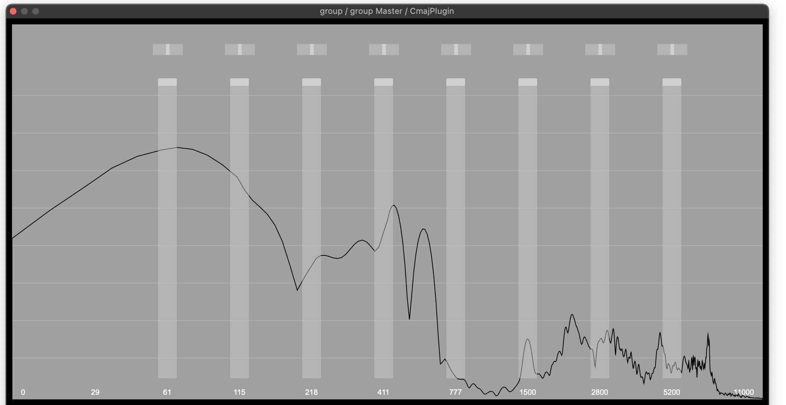

# Fixed Filter Bank

A fixed filter bank patch inspired by classic synth modules like the Serge Resonant Equalizer and the Buchla Spectral Processor. Like the Serge, it's made up of a series of bandpass filters spaced at an interval of a major seventh, which avoids the common effect of an accentuated resonance in one key. Unlike the aformentioned filter banks, this one includes panning controls for each filter.

This patch features a custom GUI built with React.js, and demonstrates frequency analysis with Cmajor's `realOnlyForwardFFT` function.



## Building The GUI

The GUI is a React app located in the `gui` directory. To build a compiled app for use in the patch (app + react bundled/minified):

```
> cd gui
> npm run build
```
