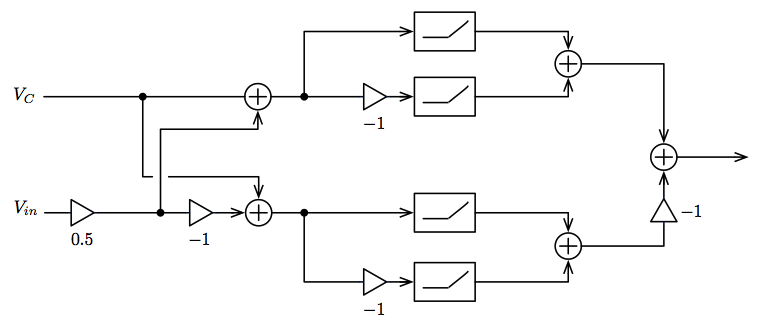

# Ring-Modulation Demo

This simple demo implements a classic ring-mod effect, famously used for scaring small children in the 1970s with Dalek voices.

It also demonstrates how to build a simple GUI that sends custom events to the patch and uses them to trigger sample playback.

The samples included are taken from the BBC's [web-audio example](https://github.com/bbc/webaudio.prototyping.bbc.co.uk/tree/master/ring-modulator)

## DSP Overview

### Ring Modulator

A ring modulator multiplies two audio signals together, resulting in a sound that is a combination of the original signals. A simple ring modulator is achieved by multiplying the input signal with a carrier signal, such as a sine wave.

The ring modulators from the TV show Dr. Who also had a characteristic distortion. This is due to the diode blocks within the analogue ring modulators of the 1950s/60s. They result in hard clipping of the signals, creating the classic distortion.

### Simplified Digital Model

For this demo, we use the simplified ring modulator research from a paper by [Julian Parker](http://recherche.ircam.fr/pub/dafx11/Papers/66_e.pdf).

This contains a block diagram and a branch equation we can use to model our example.

We use a sine wave as the modulating signal (Vin) and audioIn from the user (Vc). Two distinct diode blocks are created, each utilising a phase invert signal that is combined with the distorted signal. Both diode blocks are then summed back together to complete the ring modulation effect.
